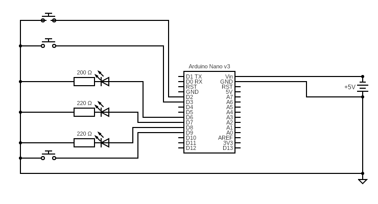
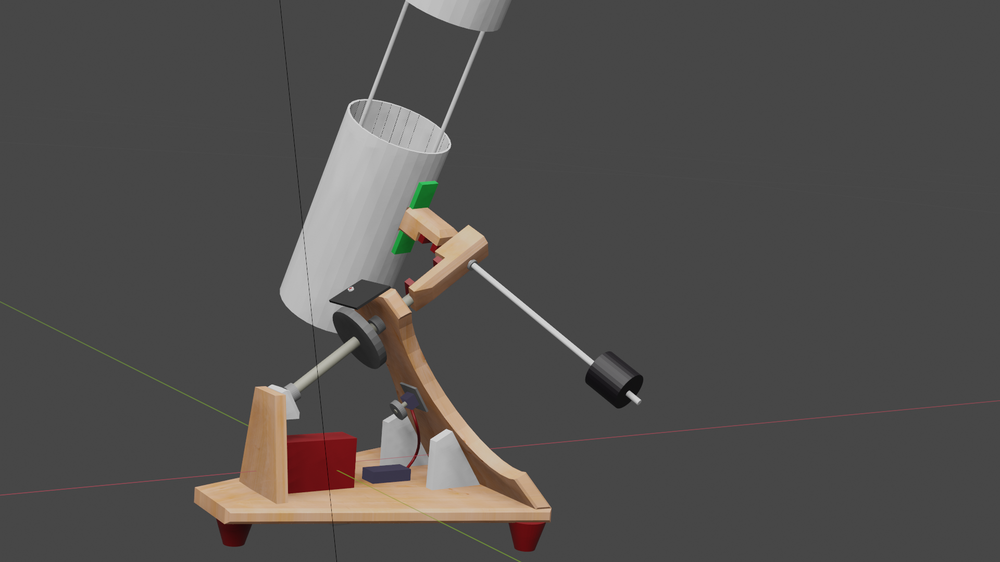

# tracker
###  Telescope right ascension drive controller
#### version 0.0.2

#### Supported architectures

 * Arduino Nano rev 3 [Verified]

#### Overview

`tracker` is the command and control code that is intended to permit an Arduino Nano rev3 drive a stepper motor at a rate that will slew a telescope right ascension drive
at the correct rate to track objects with reasonable accuracy for visual astronomy.

The Earth rotates at a rate of 1˚ every four minutes on its axis, which means that a telescope that has been correctly [Polar Aligned](https://skyandtelescope.org/astronomy-resources/accurate-polar-alignment/)
is able to track celestial objects by rotating around its Right Ascension axis opposite to the direction of Earth's rotation at the same angular rate.

1˚ every four minutes translates to a rotation rate of 0.00416(6) degrees per second on the RA axis.

Given the variability of stepper motors and the inability to provide an exhaustive set, configuration values are used intead.

#### Configuration

* The control program requires the setting of a threshold value (3 seconds in the default setup)

#### Control circuit

D2 and D3 switch inputs toggle the control system between fast-forward and reverse modes respectively.  This is interrupt-driven.  Due to the limitations of the Nano (only two interruptable digital channels), D9 is used to turn
the drive system on and off.

D6-D8 are the system state output pins and drive LEDs to indicate whether the control system is in states OFF, TRACKING, REVERSE or FAST_FORWARD.

    Compilation: 
    Sketch uses 3596 bytes (11%) of program storage space. Maximum is 30720 bytes.
    Global variables use 272 bytes (13%) of dynamic memory, leaving 1776 bytes for local variables. Maximum is 2048 bytes.

###### RA drive hardware

	|| Component || Name                                    || Reduction ratio || Rotation ˚ per step ||
	| Motor      | NEMA 17 stepper motor, 1.8˚ per step     | 1                | 1.8˚                 |
	| Gearbox    | 1:51 planetary gearbox, 8mm output shaft | 0.01960784314    | 0.03529411765        |
	| Pinion     | 16T5 11mm width pulley                   | 1                | 0.03529411765        |
	| Drive      | 45T5 11mm width pulley                   | 0.35(5)          | 0.01254901961        |

Given the figures above, it is possible to achieve the required rotation of 0.00416(6) degrees per second at a step frequency of approximately 1/3 Hz. 

This means that the controller needs to drive the stepper motor one step forward every 3 seconds approximately.

#### Tripod layout indicating major components

